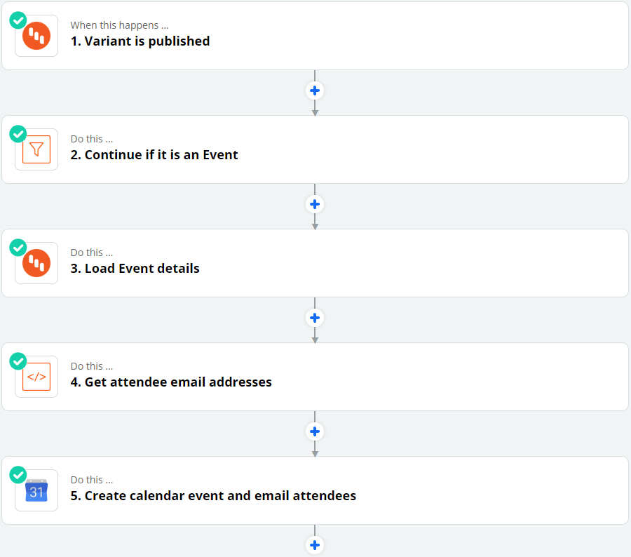
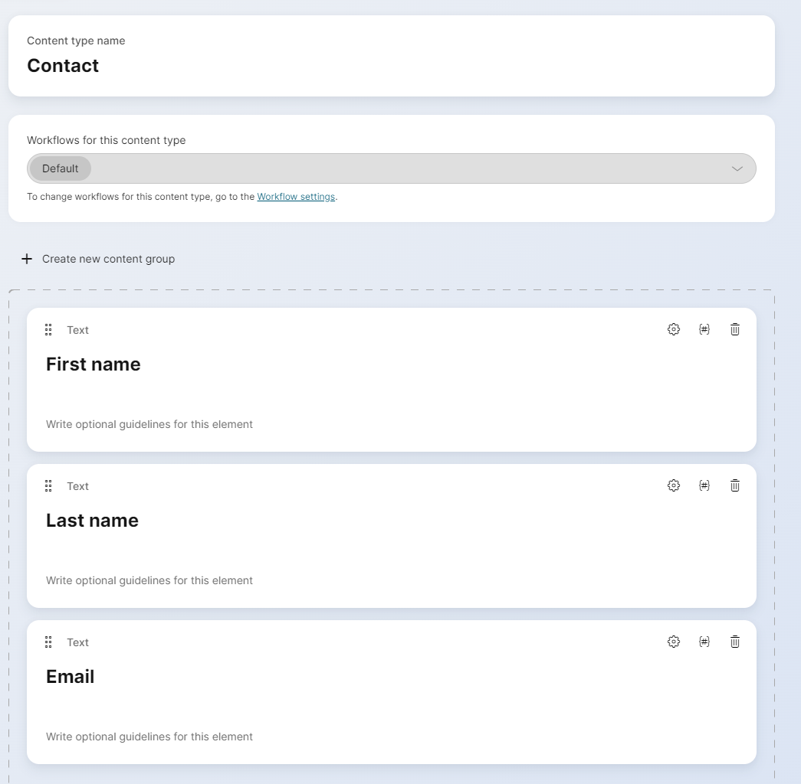

# Zapier CLI Integration

Source code for the Zapier integration with Kentico Kontent

## Integrations

This integration contains 4 triggers, 4 actions, and 2 searches:

- __Triggers__
    - Variant workflow step change
    - Variant published status change
    - Variant created or deleted
    - Taxonomy group changed
- __Actions__
    - Create content item
    - Change variant workflow step
    - Update language variant
    - Delete language variant
- __Searches__
    - Find content item
    - Find workflow step

## Creating a trigger in Zapier

Using the Kentico Kontent integration, you only need to configure the Zap in Zapier. The creation of the webhook in Kontent is handled automatically by the integration; the webhook will be created when you turn on the Zap, and deleted when you turn it off.

1. Create a new Zap: https://zapier.com/app/zaps.
2. In the _Choose App & Event_ field, search for `Kentico Kontent` then choose your trigger.


3. Click __Continue__ then __Sign in to Kentico Kontent__ on the next screen. You can find the credentials on the _API Keys_ page in Kontent.


4. Configure the conditions for your trigger. Most triggers have multiple events that can be "listened" to, and you can select multiple options or leave the field empty for all events.

5. Click __Test and Review__ to get a sample item from your Kontent project. This allows you to configure later steps using fields from your content items.

    - Most triggers have a __Content Type For Samples__ field which allows you to select a content type. If you do, the sample data for the trigger will be of that type. This has no effect on the Zap itself.

The output of the triggers will be the payload sent from Kontent, which you can read more about [here](https://docs.kontent.ai/reference/webhooks-reference). To find additional data about the item which triggered the webhook, you can use the __Find Content Item__ action.

## Example - Google calendar

Let's say your company manages events for a client. At this point, you've been using Kentico Kontent to store information about the events, but you've been manually creating the event in Google Calendar and emailing the attendees. We can now use Zapier to do this for us whenever a new event is published.

The final Zap will look something like this:



### Content types in Kontent

To start, we should have an __Event__ content type with fields for basic event information, and a __Linked items__ element which can only contain items from your __Contact__ content type:


The __Contact__ content type can contain whatever information you'd like, but should at least have an `email` element:



Create some Contact content items and publish them, then create an Event and leave it in Draft step.

### Creating the Zap

To reduce the amount of manual work that needs to be done, we want Zapier to create a calendar item and send emails whenever an Event is published in Kontent. 

#### Step 1

Of course, we start with the trigger. For the __Trigger event__ choose _Variant Published Status Changed_. In the configuration of the step, set the following:


Under __Webhook Name__ you can enter any value you'd like such as "Google Calendar Event Creation" which will appear in Kontent's Webhooks page, or you can leave it empty to use the default "Variant published status changed (Zapier)."

#### Step 2

The trigger's output will look something like this:

```
[{
"Webhook payload": {
    "data": {
        "items": [{
                "id": "1436e2dc-e53f-47f0-8721-ab65eb8080ba",
                "codename": "game_night",
                "language": "en-US",
                "type": "event"
            }
        ]
    },
    "message": {
        "id": "e2f99f74-4111-4033-8eff-54073fbd4e32",
        "project_id": ":censored:36:5ab3c81ad6:",
        "type": "content_item_variant",
        "operation": "publish",
        "api_name": "delivery_production",
        "created_timestamp": "2020-04-02T17:33:59.141Z"
    }
}
}]
```

The trigger will fire when any variant is published, but we only want to continue if it is an Event item. We can use the `type` value from the trigger and a __Filter by Zapier__ action to stop the Zap if the type is not "event:"


#### Step 3

To get information about the event, we need to add a __Find Content Item__ action. In this step, you can search for an item by ID, external ID or codename. Since the trigger output contains the item ID, you can load that value in the __Search value__ field:


#### Step 4

To send emails to the event attendees, we will need to get the contacts stored in the `attendees_list` element. The value of this element will be an array of content item IDs which correspond with the items in step 3's `modular_content` output. So, we can use a __Code by Zapier__ step to get the email addresses of the attendees for the next step.

If you're not familiar with the basics of code steps, please read [Zapier's documentation](https://zapier.com/apps/code/help). In the __Input data__ field we can load some values from the content item to use in javascript:

- __json__: The raw JSON of the modular content from step 3.
- __attendees__: The value of the `attendee_list` element, which contains the IDs of the linked items.


In the code of the step, use JSON to parse the `json` variable, then use `Object.values()` to create an array. Filter the array so that only contacts from the `attendees` variable remain, then `map` the email addresses to a new array. Then, output the emails:

```js
let modular = JSON.parse(inputData.json);
modular = Object.values(modular);
modular = modular.filter(m => inputData.attendees.includes(m.system.id));

const emails = modular.map(m => m.elements.email);

output = [{emails: emails}];
```

#### Step 5

Now we can create the Google Calendar event. In __Choose App & Event__ select _Google Calendar_ and _Create Detailed Event_. On the next screen, you'll need to authorize a Google Account which has access to the calendar you wish to modify.

On the __Customize Detailed Event__ screen, select your calendar then use data from step 3 to populate these fields:


In the event's __Attendees__ field you can load the list of emails from step 4. Google will automatically email the attendees when the event is created.


#### Testing

We're pretty much done- turn on the Zap to create the webhook in Kontent. If the On/Off switch is greyed-out in Zapier, you most likely need to test one of the steps (or, choose __Skip test__). All steps should have a green check mark in the top-left corner.

When the Zap is turned on, you should see this in Kontent:


The endpoint and secret are automatically generated by the Zapier integration and will start to work immediately. __Do not change the secret!__ Webhook signatures are automatically validated by the integration for your security, but it relies on using this exact secret which is generated by hashing several values.

You can now test the Zap by publishing an Event content item in Kontent which has some Contacts linked as attendees. After a short time, you should see the "dot" next to the webhook turn green indicating that the POST was sent to Zapier. In Zapier, you can check __Task History__ in the right sidebar to check whether the Zap executed successfully:

